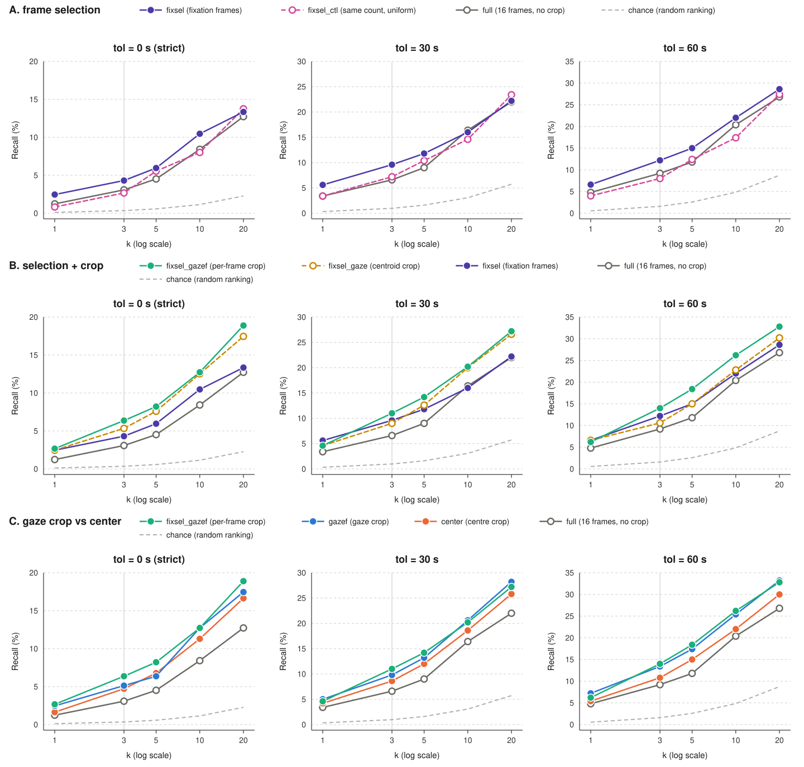
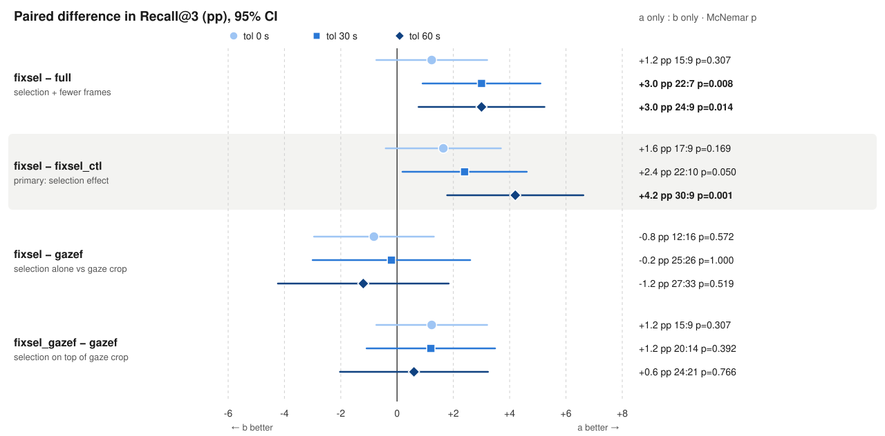
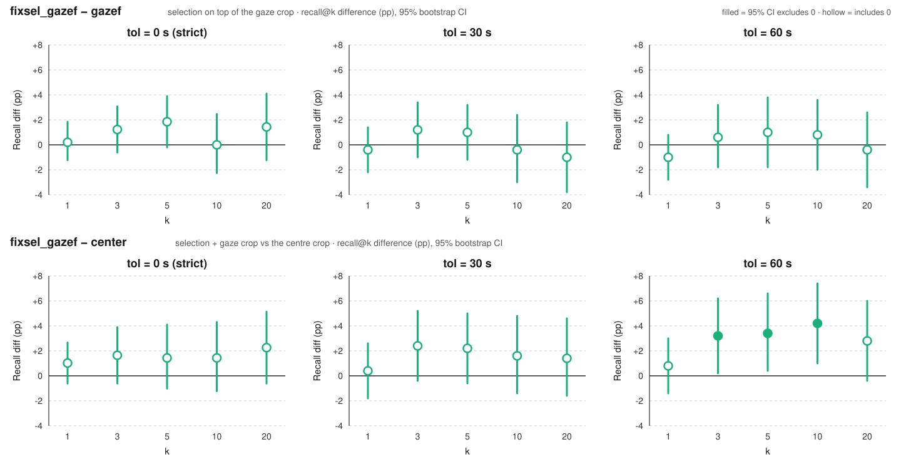
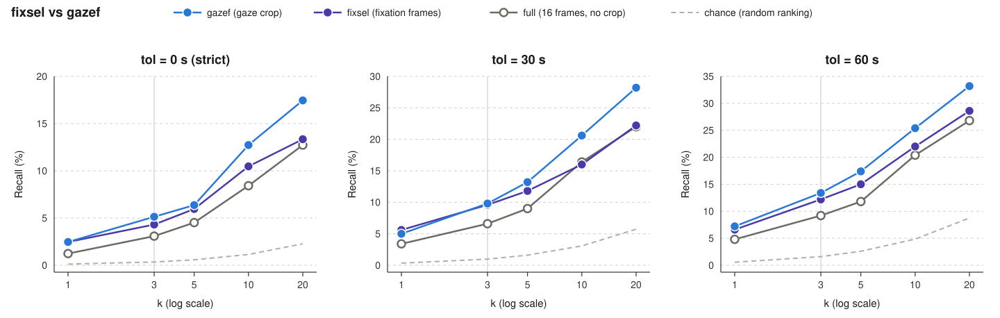

# Fixation 프레임 선택 검색 실험 (WorldMM, EgoLifeQA A1_JAKE)

> **한 줄 요약.** [`gaze_crop`](../gaze_crop/README.md)에서 시각 메모리에 "자르기"를 넣으면 검색이 좋아졌다. 이 실험은 한 단계 더 나아가
> **어떤 프레임을 임베딩할지**를 시선으로 고른다. 시선이 머문 순간(fixation)의 프레임만 임베딩하면 검색이 좋아지는가?
> 결과: **프레임을 고르기만 해도 `full`보다 낫다.** 하지만 gaze crop(`gazef`)에 선택을 더해도 `gazef`보다 낫다는 증거는 없고,
> 이득의 상당 부분은 프레임 선택보다 **자르기**에서 온다.
>
> - **프레임 선택만으로** `full` 대비 recall@3 **+1.2 / +3.0 / +3.0 %p** (tol 0 / 30 / 60). 같은 개수의 균일 프레임 대조군(`fixsel_ctl`)은
>   `full`과 구분되지 않아서(−0.4 / +0.6 / −1.2 %p) **개수가 줄어서가 아니라 고른 프레임이 좋아서**다.
> - 하지만 **미리 정한 주 결과**(tol 0, k=3, `fixsel − fixsel_ctl`)는 **+1.6 %p (p=0.17)로 유의하지 않다.** tol 60에서만
>   +4.2 %p (p=0.001)로 뚜렷하다.
> - `fixsel_gazef`(선택 + gaze crop)는 R@3 **6.4 / 11.0 / 14.0 %** 로 세 tol 모두 가장 높고 `full`보다 확실히 좋다. 하지만
>   **`gazef`와의 차이는 모든 k·tol에서 95% 신뢰구간이 0을 포함**한다. `center`보다 낫다는 증거는 tol 60의 k=3~10에서만 있다.
> - `fixsel`(crop 없이 프레임만 선택)과 `gazef`(gaze crop)를 직접 비교하면 **k=1~3에서는 거의 같고 k=10~20에서는 `gazef`가 3~6 %p 높다**(3.5).
> - 이득의 몫은 **순위 전체로는 crop이 프레임 선택보다 크고, top-3 recall로는 비슷**하다. 다만 crop에는 시선을 쓰지 않는 중앙 crop(`center`)도
>   포함되고, 이번에도 **gaze 위치가 중앙 crop보다 낫다는 증거는 없다.**
> - 검출 자체는 잘 된다. 16 프레임 중 **74%가 fixation 안**에 있고, gap 파라미터는 결과에 거의 영향이 없다.
> - **질의를 QA 키워드로 바꿔 다시 채점해도 결론은 같았다**(5.1). 프레임 선택의 이득만 조금 더 약해졌다.
>
> **다음 단계:** 프레임 개수를 16으로 고정한 `refill` 모드와 crop 위치 민감도 검사로 "선택 효과"와 "gaze crop과의 중복"을 가린다.

설계 배경은 [`../gaze_crop/README.md`](../gaze_crop/README.md), 전체 숫자는 `analysis/tables/question_query/recall_pool_all_subset_r005_tol{0,30,60}.md`에 있습니다.

---

## 1. 왜 이 실험을 했나

[gaze_crop](../gaze_crop/README.md)은 WorldMM의 시각 메모리(30초 클립을 16프레임 → **벡터 1개**로 만든 것)를 시선 주변으로 **자르기만** 해도
검색이 좋아진다는 것을 보였습니다(recall@3 9.2% → 13.4%). 다만 그 이득의 큰 몫은 중앙만 잘라도 얻는 것이었고, 시선 고유의 이득은 top-3에서
분명하지 않았습니다. gaze_crop은 "시각 메모리는 가공이 부족한 상태"라고 해석하고, 텍스트 파이프라인처럼 **가공을 한 단계씩 늘려 보자**는
다음 단계를 남겼습니다. 그 첫 번째가 이 실험(fixation으로 프레임 고르기)입니다.

`gaze_crop`의 시선 사용에는 두 가지 아쉬움이 있었습니다.

| # | 아쉬운 점 | 결과 |
|---|---|---|
| 1 | **시선 샘플 하나만 쓴다.** 프레임마다 가장 가까운 gaze 샘플 하나만 쓰고 10 Hz의 나머지는 버린다 (`gaze_common.gaze_at()`). | 그 샘플이 saccade(시선이 튀는 순간) 한가운데면 crop 박스가 의미 없는 곳을 잡는다. |
| 2 | **프레임은 시선과 무관하게 균일하게 뽑는다.** | 16 프레임 중에는 시선이 이동 중이거나 모션 블러가 낀 프레임이 섞여, 그 순간의 시선은 무엇도 "보고" 있지 않다. gaze_crop에서도 100 ms 구간의 39%가 30°/s 이상이었다. |

**가설:** 착용자가 실제로 머문 순간의 프레임만 임베딩하면 클립 벡터가 "주목한 장면" 쪽으로 옮겨가 검색이 좋아질 것이다. 시선이 안정된
프레임이라 crop 위치도 믿을 만해서, gaze crop과 합치면 더 좋아질 수도 있다.

이 실험이 답하려는 질문은 세 개입니다. 각 질문은 미리 정한 비교 하나에 대응합니다.

| # | 질문 | 대응하는 비교 |
|---|---|---|
| Q1 | fixation 프레임만 임베딩하면(crop 없이) 균일 프레임보다 검색이 좋아지나? | `fixsel − fixsel_ctl` (**주 결과**) |
| Q2 | 그 이득이 "프레임이 줄어서"가 아니라 "고른 프레임이 좋아서"인가? | `fixsel_ctl − full` |
| Q3 | 이미 잘 되던 gaze crop 위에 프레임 선택을 더하면 더 좋아지나? | `fixsel_gazef − gazef` |

LLM이 필요 없는 **recall부터** 재고, 정확도는 다루지 않습니다.

## 2. 실험 설정

### 2.1 Arm: 바뀌는 것은 "어떤 프레임을 쓰는가"

| arm | 프레임 | crop | 무엇을 확인하나 |
|---|---|---|---|
| `full` | 균일 16 | 없음 | 베이스라인 |
| `center_05` | 균일 16 | 화면 중앙 고정 | 자르기 자체의 효과 (gaze_crop) |
| `gazef_05` | 균일 16 | 프레임별 gaze | gaze crop (gaze_crop) |
| **`fixsel`** | **fixation 안에 든 것만 (~12/16)** | 없음 | **프레임 선택만의 효과** |
| `fixsel_ctl` | `fixsel`과 **같은 개수**, 클립 전체에 균일 | 없음 | 개수 통제군 |
| `fixsel_gaze_05` | fixation 안에 든 것만 | 그 fixation의 **centroid** (fixation마다 박스 하나) | 선택 + 고정 박스 |
| **`fixsel_gazef_05`** | fixation 안에 든 것만 | 프레임별 gaze (**`gazef`와 같은 crop**) | 바뀐 게 프레임 선택뿐인 비교 |

- 이름 규칙: 끝의 `f`는 박스가 프레임마다 gaze를 따라간다는 뜻입니다. `_05`는 crop 한 변이 짧은 변의 0.5배(ratio)라는 뜻입니다.
  (2026-09-29 이전에는 centroid arm을 `fixsel_gazef`라고 불렀고, 결과 파일의 키는 `fixsel_gaze_05`로 바꿨습니다.)
- 그 외는 모두 고정입니다: 임베딩 모델(VLM2Vec-V2.0), 클립당 16프레임(fixation 밖을 버린 뒤 남는 개수), `max_pixels`, 질의(질문 원문), 후보 클립 집합.
- **`fixsel_ctl`을 빼면 안 됩니다.** 프레임을 26% 버리는 것 자체가 인코더 입력의 변화이고(개수가 줄고 시간적으로 촘촘해진다) VLM2Vec은
  프레임을 pooling합니다. 이게 없으면 "`fixsel`이 `full`을 이겼다"를 "16프레임보다 12프레임이 나았다"와 분리할 수 없습니다.
  `gazef`에 `center`가 했던 역할입니다.

  ```
  fixsel - fixsel_ctl   프레임 선택의 효과          <- 이게 이 실험의 결과다
  fixsel - full         선택 효과 + "프레임이 줄었다" 가 섞인 값
  ```

- **`fixsel_gaze`와 `fixsel_gazef`의 차이는 crop 중심뿐입니다**(centroid vs 프레임별 gaze). fixation 안의 샘플은 centroid에서
  `radius=0.05` 안에 있고 박스 한 변은 0.5라서, 두 박스는 최악의 경우에도 가로·세로 90%씩(면적 약 81%) 겹칩니다. 사실상 같은 픽셀을
  봅니다. `fixsel_gazef`는 `gazef`와 crop이 완전히 같아서, 둘을 비교하면 **바뀐 것이 프레임 선택 하나뿐**입니다.
- `--select`는 두 가지입니다. `subset`(기본, 이번 결과)은 baseline이 쓰는 **같은** 16개 시각 중 fixation 밖을 버려서 개수가 클립마다 변합니다.
  `refill`은 fixation 시간 위에서 16개를 다시 뽑아 개수를 16으로 고정합니다(아직 안 돌렸다). **두 모드를 한 표에 섞지 않습니다.**
- fixation 프레임이 하나도 없는 클립은 임베딩하지 않습니다. 그 arm에서 빠지고, `recall_eval.py`가 그 클립이 정답인 문항을 `unscorable`로 뺍니다.

### 2.2 Fixation 검출 ([`fixation_sweep.py`](fixation_sweep.py), `streamgaze/`)

streamgaze의 `extract_fixation_segments`(I-DT: 같은 반경 안에 머무는 구간)를 가져다 씁니다. 이 데이터에 그대로 쓰면 **fixation이 절대
끝나지 않아서** 세 가지를 고쳤습니다. 원본의 버그라기보다 데이터셋 차이입니다. streamgaze는 invalid 샘플을 버려 시간 구멍이 생기는 데이터
(EGTEA / Ego4D / HoloAssist)를 전제로 짜였고, EgoLife gaze는 구멍 없이 10 Hz로 균일합니다.

```python
if dist > radius_thresh:
    gap_duration = timestamps[i] - timestamps[i-1]   # 연속 샘플 간 dt
    if gap_duration <= gap_thresh:                   # 10 Hz 에서 항상 0.1 <= 0.2 -> 항상 참
        i += 1; continue                             # -> 클립 전체가 fixation 1 개
```

30초 동안 두 지점을 1초씩 번갈아 보는 합성 신호로 확인했습니다: 원본은 `n_fix = 1` (29.9초), 수정본은 `n_fix = 30`.

| 수정 | 내용 |
|---|---|
| `gap_thresh`의 의미 | 이탈이 시작된 지점부터 시간을 재고, 반경 안으로 돌아오면 리셋한다. 이제 진짜로 "반경 밖에 머문 시간"이다. |
| `dropout_thresh` 신설 (기본 0.4초) | 샘플 결손(눈깜빡임·트래킹 실패)은 반경 이탈과 성격이 다르다. 눈깜빡임은 flick보다 길어서 임계도 따로 둔다. 결손 구간은 centroid 평균에서 뺀다. |
| 거리 기준: 첫 샘플 → running centroid | 첫 샘플 노이즈에 구간 전체가 끌려가지 않는다. 용서된 이탈 샘플은 centroid 계산에서 제외한다. |

사용한 값: `radius=0.05` (정규화 이미지 거리, Aria 1408×1408에서 약 70 px ≈ 6–7°), `min_dur=0.3s`, `gap=0.2s`, `dropout=0.4s`.

**긴 fixation 검사 ([`plot_long_fixations.py`](plot_long_fixations.py)).** sweep의 `>3s`가 진짜 fixation인지 잘못 묶인 smooth pursuit인지 가릅니다.
판별 지표는 gaze 경로의 **모양**입니다.

```
straightness = |마지막 - 처음| / (스텝 길이의 합)     # 0.3초 평활한 경로 위에서
```

반드시 **평활한 경로에서** 재야 합니다. 원시 샘플로 재면 분모(path)에는 샘플마다의 tracker 노이즈가 전부 더해지고 분자(net)는 검출기의
`radius`에 막혀서, drift가 있든 없든 긴 구간은 전부 0 근처로 눌립니다. 시뮬레이션으로 보정한 임계(평활 후):

| | jitter 0.002 | 0.008 | 0.015 |
|---|---|---|---|
| **drift 0 (진짜 fixation)** | 0.05 | 0.05 | 0.05 |
| pursuit 0.005/s | 0.59 | 0.15 | 0.07 |
| pursuit 0.010/s | 0.84 | 0.32 | 0.16 |
| pursuit 0.020/s | 0.96 | 0.63 | 0.33 |

`<= 0.15`는 진짜 fixation, `>= 0.30`은 pursuit입니다. 노이즈가 큰 상태의 느린 drift(0.005/s)는 여전히 숨지만, 6초에 화면의 0.03이라
crop 박스를 움직이지 못해서 이 실험에서는 문제가 아닙니다. 그림에서 노란 점은 현재 gaze, 파란 점은 이 fixation의 이전 샘플들입니다.
pursuit이면 파란 점이 패널을 가로지르는 선을 그리고, 진짜 fixation이면 한 덩어리로 뭉칩니다.

### 2.3 채점

| 항목 | 설정 |
|---|---|
| 후보 클립 | 6,223개 전체 = 실제 인덱스. 질문 시각 이전에 끝난 클립만 후보 |
| 문항 | A1_JAKE **500문항 전부** (gaze_crop의 `pool_all.json`, `questions_500.json`을 읽기만 함) |
| 검색 방식 | 클립의 (crop한) 프레임들을 `encode_video`(VLM2Vec-V2.0)에 넣어 벡터 하나로 만들고, 질문 원문을 `encode_vis_query`로 임베딩해 유사도 순위를 낸다. 전사문·오디오는 검색 입력에 없다. |
| 정답 | **tol 0s**: `target_time`이 들어가는 30초 클립 하나 (엄격, 487문항 채점 — 정답 클립이 풀에 없는 13문항 제외). **tol 30s / 60s**: ±30 / ±60초 안의 이웃 클립도 정답 (500문항 모두 채점) |
| 지표 | recall@k (k=3이 중심), 정답 순위 중앙값, chance(무작위 순위) 수준 |
| 비교 방법 | k=3 짝지은 McNemar + 95% Wald CI, 문항을 다시 뽑는 부트스트랩 95% CI(recall 차이), 정답 순위를 문항별로 비교한 부호검정(올랐다:내렸다), 로그 순위에 대한 Wilcoxon 부호순위 검정 |

**주 결과는 tol 0s, k=3의 `fixsel − fixsel_ctl`로 실행 전에 정해 두었고**, tol 30/60은 같은 임베딩을 다시 채점한 강건성 확인입니다.
tol이 크면 정답이 늘어 recall이 저절로 오르므로 **같은 tol끼리만** 비교합니다. 검정은 tol별로 따로 했고 다중비교 보정은 하지 않았습니다.

## 3. 결과

### 3.1 Fixation 검출: 16 프레임의 74%가 fixation 안에 있다

A1_JAKE 6,222 클립, `radius=0.05  min_dur=0.3s  dropout=0.4s`:

| gap | fix/clip | dur_med | dur_p90 | coverage | >3s |
|---|---|---|---|---|---|
| 0.1 | 20.37 | 0.70s | 2.20s | 73.7% | 5.4% |
| 0.2 | 18.54 | 0.80s | 2.50s | 74.5% | 6.7% |
| 0.3 | 16.56 | 0.90s | 2.80s | 75.0% | 8.5% |

- **coverage 74%.** `embed_arms.py`가 crop하는 16개 프레임 중 3/4이 fixation 안에 있습니다. 프레임 선택 arm을 만들 가치가 있다고 판단한 근거입니다.
- **gap은 중요한 파라미터가 아닙니다.** 세 지표가 매끄럽게 단조 변화하고(무릎 없음) coverage가 거의 안 움직입니다(총 1.3 %p).
  gap을 늘려 사라진 fixation은 원래 프레임을 커버하지 않던 짧은 조각이고, 늘어난 건 병합입니다. `0.2`를 썼습니다(0.3은 얻는 것 없이
  병합만 늘고, 0.1은 눈깜빡임 전후 튐을 못 넘겨 조각을 만듭니다).
- 정합성: 30초 클립당 18.5개 × 평균 ~1.1초 ≈ 20초 ≈ 67%로 coverage 74%와 일관됩니다. fixation이 하나도 없는 클립은 0%라 폴백만 타는 죽은 클립도 없고,
  `dur_med 0.8s`가 `min_dur=0.3s` 바닥에서 충분히 떨어져 있어 검출 결과가 임계값에 눌린 인공물도 아닙니다.

### 3.2 Recall@k: 선택도 crop도 `full`보다 낫고, `fixsel_gazef`가 가장 높다

<picture>
  <source media="(prefers-color-scheme: dark)" srcset="analysis/figures/recall_at_k_curves_dark.svg">
  
</picture>

세 행은 서로 다른 질문에 답합니다. 열은 tol 0 / 30 / 60초이고, 세로선은 k=3, 회색 점선은 무작위 순위(chance)입니다. 곡선은 **k ≤ 20**까지만
그렸습니다(k=50은 6,223 클립 중 상위 0.8%로 실제 시스템이 쓰는 top-3과 거리가 멀다). k=50 값은 `analysis/tables/question_query/recall_pool_all_subset_r005_tol*.md`와
`analysis/tables/question_query/recall_fix_only.md`에 있습니다. 세로축을 좁게 잡았기 때문에 같은 격차가 실제보다 크게 보일 수 있습니다.

- **A. 프레임 선택** — `fixsel`(보라)이 `fixsel_ctl`(분홍 점선)과 `full`(회색)보다 k=1~10에서 대체로 위에 있고, k=20에서는 세 선이 모입니다.
  `fixsel_ctl`은 `full`과 거의 붙어 있어서, 이득이 "프레임이 줄어서"는 아닙니다.
- **B. 선택 + crop** — crop을 얹은 두 arm(`fixsel_gazef` 초록 실선, `fixsel_gaze` 황갈색 점선)이 `fixsel`, `full` 위에 있습니다. 두 arm은 거의 겹칩니다
  (crop 중심만 다르고 사실상 같은 픽셀을 봄).
- **C. gaze crop vs center** — `fixsel_gazef`, `gazef`(파랑), `center`(주황)가 모두 `full`보다 위입니다. `fixsel_gazef`가 대체로 가장 위에 있지만
  `gazef`와의 간격은 작고, 일부 (tol, k)에서는 `gazef`가 같거나 높습니다.

**R@3 과 순위 중앙값** (순위는 낮을수록 좋음):

| arm | R@3 tol0 | 순위 중앙값 tol0 | R@3 tol30 | 순위 중앙값 tol30 | R@3 tol60 | 순위 중앙값 tol60 |
|---|---|---|---|---|---|---|
| `full` | 3.1% | 289 | 6.6% | 166 | 9.2% | 99 |
| `fixsel_ctl` | 2.7% | 268 | 7.2% | 137 | 8.0% | 105 |
| `fixsel` | 4.3% | 292 | 9.6% | 145 | 12.2% | 91 |
| `center_05` | 4.7% | **245** | 8.6% | **108** | 10.8% | 81 |
| `gazef_05` | 5.1% | 249 | 9.8% | 113 | 13.4% | **76** |
| `fixsel_gaze_05` | 5.3% | 261 | 9.0% | 122 | 10.6% | 80 |
| **`fixsel_gazef_05`** | **6.4%** | 268 | **11.0%** | 117 | **14.0%** | 83 |
| _chance_ | _0.34%_ | _1,273_ | _0.97%_ | _642_ | _1.6%_ | _428_ |

R@3만 보면 `fixsel_gazef`가 세 tol에서 모두 가장 높습니다. 하지만 순위 중앙값은 `center`/`gazef`가 더 좋아서 **지표에 따라 1등이 바뀝니다.**
`center_05`의 tol 0 값은 이 실행에서 채점하지 않아 `../gaze_crop/results/recall_arms_tol0.json`에서 가져왔습니다. 같은 풀·임베딩·487문항이고,
`full`/`gazef` 순위가 문항 단위로 완전히 같은지 스크립트가 확인한 뒤에만 합칩니다.

### 3.3 k=3 짝지은 비교: 선택 효과는 tol이 넓을 때만 뚜렷하다

<picture>
  <source media="(prefers-color-scheme: dark)" srcset="analysis/figures/paired_diff_recall_at_3_dark.svg">
  
</picture>

각 행의 오른쪽 숫자는 `차이(%p)  앞 arm만 맞힘 : 뒤 arm만 맞힘  McNemar p`이고, 굵은 글씨는 p<0.05입니다.

- **선택 효과(주 비교, 회색 띠)는 세 tol 모두 같은 방향이고, tol이 넓을수록 커집니다.** `fixsel − fixsel_ctl`은 +1.6 → +2.4 → +4.2 %p입니다.
  미리 정한 주 결과(tol 0)는 **p=0.17로 유의하지 않습니다.** tol 60의 p=0.001(30:9)은 tol 3개에 대한 Bonferroni(0.017)를 통과하지만,
  tol을 바꿔 본 결과이므로 확증이 아니라 신호로 읽습니다.
- **`fixsel − full`은 +1.2 / +3.0 / +3.0 %p로 tol 30·60에서 유의합니다**(p=0.008, 0.014). 이 값에는 선택 효과와 "프레임이 줄었다"는 효과가 섞여 있는데,
  개수 통제군 `fixsel_ctl`이 `full`과 구분되지 않아서(`fixsel_ctl − full` = −0.4 / +0.6 / −1.2 %p, 모두 유의하지 않음, 그림에는 넣지 않았다)
  **개수 교란은 없고 대부분 선택 효과로 읽을 수 있습니다.**
- **`fixsel − gazef`는 −0.8 / −0.2 / −1.2 %p로 구분되지 않습니다.** crop 없이 프레임만 골라도 top-3 recall은 gaze crop과 비슷합니다.
- **`fixsel_gazef − gazef`는 +1.2 / +1.2 / +0.6 %p로 유의하지 않습니다**(McNemar p=0.31 / 0.39 / 0.77).

### 3.4 `fixsel_gazef`는 `gazef`, `center`보다 나은가: 신뢰구간

<picture>
  <source media="(prefers-color-scheme: dark)" srcset="analysis/figures/recall_diff_ci_fixsel_gazef_dark.svg">
  
</picture>

점은 recall 차이(%p), 세로선은 문항을 다시 뽑은 부트스트랩(4,000회)의 95% 신뢰구간이고, **속이 찬 점은 구간이 0을 포함하지 않는다**는 뜻입니다.

- **`fixsel_gazef − gazef`**: 15개 점이 모두 빈 점입니다. 어느 tol, 어느 k에서도 구간이 0을 포함하고 폭이 ±3 %p 안팎입니다.
- **`fixsel_gazef − center`**: tol 60의 k=3, 5, 10에서만 속이 찬 점입니다(+3.2 / +3.4 / +4.2 %p). 나머지 12개는 구간이 0을 포함합니다.

정답 **순위 전체**로 비교한 검정도 같은 그림을 줍니다. 셀은 정답 순위가 앞 arm이 더 좋은 문항 : 뒤 arm이 더 좋은 문항이고 괄호는 부호검정 p입니다.
굵은 글씨는 p<0.05입니다.

| 비교 | tol 0 | tol 30 | tol 60 |
|---|---|---|---|
| `fixsel − fixsel_ctl` (선택 효과) | 246:236 (0.68) | 246:238 (0.75) | 257:216 (0.066) |
| `fixsel − gazef` (crop 없음 vs 있음) | **217:263 (0.040)** | **217:265 (0.032)** | **214:263 (0.028)** |
| `fixsel_gazef − gazef` (gaze crop에 선택 추가) | 223:254 (0.17) | 256:217 (0.080) | **252:208 (0.045)** |
| `fixsel_gazef − center` | 237:247 (0.68) | 260:220 (0.075) | **263:209 (0.015)** |
| `fixsel_gazef − fixsel` (선택에 crop 추가) | 249:231 (0.44) | **268:214 (0.016)** | **271:206 (0.003)** |
| `fixsel_gazef − fixsel_gaze` (crop 중심만 다름) | 242:232 (0.68) | 250:227 (0.31) | 256:217 (0.080) |
| `fixsel_gazef − full` | 259:222 (0.10) | **290:197 (<0.001)** | **290:194 (<0.001)** |

`fixsel_gazef − gazef`는 부호검정으로는 tol 60에서만 `fixsel_gazef` 쪽(p=0.045)이지만, 로그 순위에 대한 Wilcoxon 검정은 세 tol 모두 p>0.3입니다
(로그 순위 이득 중앙값 −0.03 / +0.02 / +0.02). 검정마다 결과가 갈리는 경계선 결과는 "차이 없음"으로 보는 게 안전합니다.
`full`과의 차이만 두 검정 모두에서 확실합니다(Wilcoxon 로그 순위 이득 +0.06 / +0.26 / +0.23, tol 30·60 p<0.0001).


### 3.5 `fixsel` vs `gazef`: crop 없이 프레임만 고른 것과 gaze crop

프레임을 고르는 것(`fixsel`)과 자르는 것(`gazef`) 중 어느 쪽이 검색에 더 기여하는지 직접 비교합니다. 두 arm은 서로 다른 것을 바꿉니다
(`fixsel`은 fixation 프레임만 쓰고 crop 없음, `gazef`는 균일 프레임에 프레임별 gaze crop).

<picture>
  <source media="(prefers-color-scheme: dark)" srcset="analysis/figures/recall_at_k_fixsel_vs_gazef_dark.svg">
  
</picture>

파랑이 `gazef`, 보라가 `fixsel`, 회색이 `full`입니다. k=1~3에서는 `fixsel`과 `gazef`가 거의 겹치고, k=10~20에서 `gazef`가 위로 벌어집니다.
세로축을 좁게 잡았기 때문에 같은 격차가 실제보다 크게 보일 수 있습니다.

**Recall (%)**, 굵은 글씨가 더 높은 쪽:

| | arm | k=1 | k=3 | k=5 | k=10 | k=20 | 순위 중앙값 |
|---|---|---|---|---|---|---|---|
| tol 0 | `fixsel` | 2.5 | 4.3 | 6.0 | 10.5 | 13.3 | 292 |
| | `gazef_05` | 2.5 | **5.1** | **6.4** | **12.7** | **17.5** | **249** |
| tol 30 | `fixsel` | **5.6** | 9.6 | 11.8 | 16.0 | 22.2 | 145 |
| | `gazef_05` | 5.0 | **9.8** | **13.2** | **20.6** | **28.2** | **113** |
| tol 60 | `fixsel` | 6.6 | 12.2 | 15.0 | 22.0 | 28.6 | 91 |
| | `gazef_05` | **7.2** | **13.4** | **17.4** | **25.4** | **33.2** | **76** |

- **k가 작을 때는 거의 같습니다.** k=1, 3에서 차이는 0~1.2 %p이고 k=3의 McNemar 검정은 유의하지 않습니다(−0.8 / −0.2 / −1.2 %p, p>0.5).
  tol 30의 k=1에서는 `fixsel`이 오히려 조금 높습니다.
- **k가 커질수록 `gazef`가 앞섭니다.** k=10~20에서 3~6 %p 높고, 세 tol 모두 같은 방향입니다. 순위 중앙값도 `gazef`가 더 좋습니다.
- **순위 전체로는 세 tol 모두 `gazef`가 유의하게 낫습니다.** 정답 순위가 더 좋은 문항이 `fixsel` 217 : `gazef` 263 (p=0.040), 217 : 265 (p=0.032),
  214 : 263 (p=0.028)입니다(3.4의 표 참고).

정리하면 **top-3에서는 프레임만 골라도 gaze crop과 비슷하지만, 그 아래 순위에서는 crop이 더 많이 올려줍니다.** 프레임 선택은 top 근처의 몇 문항에,
crop은 순위 전체에 작용한다는 4장의 해석과 같은 그림입니다. 다만 `gazef`의 이점에는 gaze를 쓰지 않는 중앙 crop(`center`)도 함께 얻는 몫이 있어서,
이것을 "gaze 정보가 프레임 선택보다 낫다"로 읽으면 안 됩니다.

## 4. 결과를 어떻게 해석할 수 있나

1. **fixation 프레임을 고르는 것은 crop 없이도 `full`을 개선합니다.** 개수 통제군은 `full`과 구분되지 않아서 이득을 "프레임이 줄어서"로 설명하기 어렵습니다.
   다만 순수한 선택 효과(`fixsel − fixsel_ctl`)는 미리 정한 기준(tol 0)에서 유의하지 않고 tol 60에서만 뚜렷합니다. 시선 정보가 "정확한 30초"를 짚는다기보다
   **그 근처로 가는 것**을 돕는 것으로 읽는 게 안전합니다(가설이고, 이 데이터만으로 원인을 가릴 수는 없습니다).
2. **선택의 이득은 일부 문항을 top으로 끌어올리는 형태입니다.** `fixsel − fixsel_ctl`은 k ≤ 10에서 `fixsel` 쪽으로 기울지만 500문항 전체의 순위는 거의 반반입니다
   (tol 60에서도 257:216, p=0.066). 평균적인 개선이 아니라 몇몇 문항의 큰 개선입니다.
3. **`fixsel_gazef`가 가장 높지만, gaze crop 위에 프레임 선택을 얹는 이득은 확인되지 않았습니다.** `full`보다는 확실히 낫지만(순위 기준 tol 30·60 p<0.001)
   이는 `gazef`도 얻는 이득입니다. `gazef`와의 차이는 15개 (tol, k) 모두에서 신뢰구간이 0을 포함하고, `center`보다 낫다는 증거는 tol 60의 k=3~10에서만 있습니다.
   **그럴듯한 설명은 "중복"입니다(가설).** 프레임 선택이 시선 밖 내용이 섞인 프레임을 빼서 얻는 이득을 crop이 이미 얻고 있어서 합쳐도 새로 더해지는 게 적다는 것입니다.
   이 결과만으로는 검증되지 않았습니다.
4. **이득의 몫은 순위 전체로는 crop이, top-3로는 둘이 비슷합니다.** crop 없는 `fixsel`은 `gazef`보다 top-3에서는 구분되지 않지만(−0.8 / −0.2 / −1.2 %p) 순위 전체로는
   세 tol 모두 `gazef`가 낫고(p=0.03~0.04), `fixsel_gazef − fixsel`도 tol 30·60에서 유의합니다(p=0.016, 0.003). 선택은 top 근처의 몇 문항에, crop은 순위 전체에 작용하는 모습입니다.
5. **하지만 "crop의 효과"에는 gaze를 쓰지 않는 중앙 crop이 포함됩니다.** `center`도 `full`보다 좋습니다. 시선 위치 덕분인 부분은 `gazef − center`로 봐야 하는데 이번에도
   유의하지 않았습니다(순위 기준 p=0.06 / 0.28 / 0.07, gaze_crop과 같은 결과). 따라서 "crop이 프레임 선택보다 크다"가 "gaze 정보가 프레임 선택보다 크다"로 이어지지는 않습니다.
   반면 `gazef`는 시선을 무작위로 바꾼 `randf`보다는 낫습니다(gaze_crop, tol 0 순위 검정 p<0.001). 시선이 더하는 것이 있다면 "움직임"이 아니라 **위치**이지만,
   그 이득이 중앙 crop을 넘는지는 아직 모릅니다.
6. **centroid냐 프레임별이냐는 문제가 아닙니다.** `fixsel_gazef`는 `fixsel_gaze`와 구분되지 않습니다(부호검정 p=0.68 / 0.31 / 0.080). 두 박스가 거의 같은 픽셀을 보기 때문에 예상한 결과입니다.
7. **모든 이득이 순위가 깊은 곳에서 주로 나옵니다.** 실제 시스템이 쓰는 top-3에서는 작습니다. 최종 QA 정확도로 이어지는지는 별개로 확인해야 하고, 이 실험은 검색까지만 봤습니다.

| 질문 | 답 | 근거의 강도 |
|---|---|---|
| fixation 프레임만 골라도 `full`보다 낫다 | 예 | tol 30·60에서 유의, tol 0에서는 아님 |
| 그 이득이 개수 감소 때문이 아니다 | 예 | `fixsel_ctl − full` 유의하지 않음 |
| 순수한 선택 효과(`fixsel − fixsel_ctl`)가 있다 | tol 60에서만 | 주 결과(tol 0) 유의하지 않음 |
| gaze crop 위에 선택을 얹어 더 좋아진다 | 증거 없음 | 15개 (tol, k) 모두 CI가 0 포함 |
| `fixsel_gazef`가 `center`보다 낫다 | tol 60의 k=3~10에서만 | 나머지 12개는 CI가 0 포함 |
| gaze 위치가 중앙 crop보다 낫다 (`gazef − center`) | 증거 없음 | 순위 p 0.06~0.28 |

**실무적으로는:** 프레임 선택은 crop을 안 쓸 때 `full`을 개선하는 간단한 방법입니다. 하지만 gaze crop을 이미 쓴다면 추가로 얻는 게 적습니다.

## 5. 다음 단계

우선순위 순입니다.

| 실험 | 비용 | 무엇을 가리나 |
|---|---|---|
| ~~5.1 키워드 질의로 fixation arm 채점~~ (**완료, 효과 별로 없었음**) | GPU 불필요 | 원문 질의는 신호가 약해 arm 간 차이가 가려졌을 수 있다 → 결론이 바뀌지 않았다 |
| **5.2 `SELECT=refill` (개수 16 고정)** | GPU, 약 3시간 | 개수 교란을 설계에서 없애도 선택 효과가 남는가 |
| **5.3 crop 위치 민감도 (perturbation)** | GPU, 작음 | 문항별 "gaze 덕분에 1위"가 노이즈인가 |
| 5.4 `ratio` 스윕 (0.35 / 0.5 / 0.7) | GPU, arm당 약 3시간 | 박스를 작게 해서 gaze와 중앙의 차이를 키운다 |
| 5.5 `radius` 스윕 (0.03 / 0.05 / 0.08) | GPU 불필요 (sweep) | coverage와 `>3s`의 trade-off |
| 5.6 QA 정확도로 확인 | LLM 비용 | recall 이득이 실제 답에 반영되는가 |
| 5.7 다른 피험자·다른 임베딩 모델 | 중간 | 일반화 |

### 5.1 키워드 질의로 fixation arm 채점 — 완료, 결론은 바뀌지 않았다

질문 원문은 "Who / before / first" 같은 표현이 많아 장면 임베딩과 잘 안 맞고 recall이 낮아서, arm 간 차이가 가려졌을 수 있다고 보고 QA의 키워드(`use screwdriver` 같은 짧은 구)로 다시 채점했습니다.
임베딩은 그대로이고 질의만 바꿨습니다(GPU 불필요). 키워드는 QA 주석에서 온 값이라 실제 서비스에서는 쓸 수 없으므로 상한선을 보는 용도입니다.

```bash
python experiments/gaze_crop/recall_eval.py --pool experiments/gaze_crop/pool_all.json \
    --arms full center_05 gazef_05 fixsel fixsel_ctl fixsel_gaze_05 fixsel_gazef_05 \
    --query-source keywords --target-tolerance-sec 0 \
    --out experiments/fixation_frame_selection/results/recall_pool_all_subset_r005_kw_tol0.json \
    --markdown experiments/fixation_frame_selection/analysis/tables/keyword_query/recall_pool_all_subset_r005_kw_tol0.md
```

tol 30, 60도 같은 방식으로 돌렸고 결과는 `analysis/tables/keyword_query/recall_pool_all_subset_r005_kw_tol{0,30,60}.md`에 있습니다.

**R@3 (%), 키워드 질의:**

| arm | tol 0 | tol 30 | tol 60 |
|---|---|---|---|
| `full` | 5.1 | 8.8 | 11.0 |
| `fixsel_ctl` | 3.5 | 8.0 | 10.2 |
| `fixsel` | 4.9 | 8.8 | 12.6 |
| `center_05` | 5.5 | 8.6 | 10.8 |
| `gazef_05` | 6.2 | 9.8 | 12.0 |
| `fixsel_gaze_05` | 5.7 | 8.6 | 11.4 |
| `fixsel_gazef_05` | 6.2 | 9.8 | 12.2 |

**결과: 키워드로 바꿔도 얻은 것이 별로 없었습니다.**

- **결론이 원문 질의와 같습니다.** crop(`gazef`, `fixsel_gazef`)은 `full`보다 순위 전체로 확실히 낫고(Wilcoxon p<0.001, 세 tol 모두), `fixsel_gazef`는 `gazef`와 구분되지 않으며
  (R@3 차이 0.0 / 0.0 / +0.2 %p, 순위 검정 p=0.66 / 0.27 / 0.62), `gazef`는 `center`와 구분되지 않습니다(순위 Wilcoxon p=0.29 / 0.22 / 0.11).
  `fixsel`은 `gazef`보다 top-3는 비슷하고 순위 전체로는 뒤집니다(p=0.009 / 0.006 / 0.003).
- **프레임 선택의 이득은 오히려 더 약해졌습니다.** `fixsel − full`의 R@3이 원문에서는 +1.2 / +3.0 / +3.0 %p였는데 키워드에서는 −0.2 / 0.0 / +1.6 %p이고, `fixsel − fixsel_ctl`도
  +1.4 / +0.8 / +2.4 %p로 세 tol 모두 유의하지 않습니다(p=0.12 / 0.59 / 0.07). 방향은 여전히 양수라서 "이득이 없다"기보다 질의에 따라 흔들리는 작은 효과입니다.
- **절대 수준도 별로 오르지 않았습니다.** 6,223 클립 전체 풀에서는 키워드로 바꿔도 R@3이 tol 0에서 3~5% → 5~6% 정도입니다. 623 클립 stage 1 풀에서는 5~6배 올랐지만
  풀이 10배 커지면 키워드도 큰 도움이 되지 않습니다.

따라서 **"질의가 약해서 arm 간 차이가 가려졌다"는 가설은 지지되지 않았고**, 이 실험의 결론은 질의 방식에 크게 의존하지 않습니다. 표본 500문항, tol 3개 × 비교 여러 개에 다중비교 보정이 없다는 한계는 그대로입니다.

### 5.2 `SELECT=refill`

개수를 16으로 고정해 개수 교란을 설계 차원에서 없앱니다. `fixsel_ctl` 통제군에 기대지 않고도 같은 결론이 나오는지가 관건입니다. baseline이 본 적 없는 시각을 보게 되므로
`subset` 결과와 한 표에 섞지 않습니다.

```bash
SELECT=refill CUDA_VISIBLE_DEVICES=1 nohup bash run_recall.sh > /dev/null 2>&1 &
```

### 5.3 crop 위치 민감도 검사

`gazef`와 `center`의 박스가 크게 겹치는데도 문항별 순위가 크게 달라집니다(예: 어떤 문항은 `center` 246위, `gazef` 1위). 같은 클립에서 박스를 ±수 %p 흔든 변형으로
순위가 얼마나 변하는지 재서, 개별 문항의 "gaze 덕분에 1위"를 노이즈와 구분합니다. 순위가 크게 흔들리면 crop 위치의 작은 차이가 원인이고, 1위 근처에서 안정적이면 시선 위치가 실제로 기여한 것입니다.

## 6. 한계

- **질의가 질문 원문입니다.** 키워드 질의로도 채점했지만 결론은 같았습니다(5.1). 대화로만 답이 나오는 문항(`need_audio`)은 화면에 정답이 없어서 검색이 시각으로 풀 수 없습니다.
- 피험자 1명, 임베딩 모델 1개, ratio 1개(0.5), `radius` 1개(0.05). ratio 0.5에서는 `gazef`와 `center`의 박스가 많이 겹쳐 gaze 고유 효과를 가르기 어렵습니다.
- **다중비교 보정을 하지 않았습니다.** tol 3개 × 비교 여러 개를 각각 검정했고, 신뢰구간도 (tol, k) 15개 점마다 따로 계산했습니다. p≈0.03~0.05 결과나 tol 60의 속이 찬 점 3개는 약한 근거로만 읽습니다.
- 부트스트랩 신뢰구간은 500문항 안에서 문항을 다시 뽑은 것이라, 피험자·모델·질의 방식이 달라지는 불확실성은 담고 있지 않습니다.
- **이득이 순위 깊은 곳에 몰려 있어** top-3 정확도로 곧바로 환산할 수 없습니다. QA 정확도는 이 실험에서 재지 않았습니다.
- **I-DT는 smooth pursuit을 fixation과 구별하지 못합니다.** 천천히 움직이는 대상을 따라가도 연속 샘플은 서로 가깝습니다(`plot_long_fixations.py`로 검사).
- **10 Hz로는 saccade를 못 잡습니다.** saccade는 20–80 ms라 샘플 한 개 안에서 끝납니다. streamgaze의 I-VT는 이 데이터에서 의미가 희박합니다. fixation은 보통 200 ms 이상(샘플 2개 이상)이라 검출이 성립합니다.
- **여기서 말하는 fixation은 "이미지 상에서 안정된 응시"입니다.** EgoLife gaze는 eye-in-head yaw/pitch를 카메라 평면에 투영한 값이라, 머리가 돌아가는 동안 세계의 한 점을 계속 보면(VOR) 이미지 좌표상 gaze는 움직입니다.
  crop 박스 안정화가 목적이라면 오히려 이 정의가 맞습니다.
- **`radius`는 각도가 아니라 이미지 거리입니다.** 프레임이 정사각형이 아니면 `hypot`이 x/y를 다른 척도로 섞습니다(1408×1408에서는 문제 없음).
- **시선 좌표는 근사입니다**(캘리브레이션 없이 단일 focal로 투영). 자세한 오차는 [gaze_crop 6장](../gaze_crop/README.md#6-한계) 참고.

## 7. 재현

```bash
cd ~/WorldMM && source .venv/bin/activate
cd experiments/fixation_frame_selection

# fixation 임계값 sweep (GPU 불필요)
python fixation_sweep.py                                  # gap 0.1/0.2/0.3
python fixation_sweep.py --gap 0.2 --radius 0.03          # radius 는 한 번에 하나씩

# 긴 fixation 눈으로 확인 -> analysis/figures/long_fixations.jpg
python plot_long_fixations.py                             # 가장 긴 6 개
python plot_long_fixations.py --sort straightness         # pursuit 의심 순
python plot_long_fixations.py --min-dur-shown 5 --rows 10

# GPU 불필요: 프레임 개수 / 버려진 클립만 센다 (기본 pool.json, 623 클립)
python embed_fix_arms.py --dry-run

# 임베딩 + recall 비교 (tol 0/30/60). 기본이 전체 풀(6,223 클립 / 500 문항)이라 처음부터는 ~6시간이다
CUDA_VISIBLE_DEVICES=1 nohup bash run_recall.sh > /dev/null 2>&1 &
tail -f logs/recall_*.log

POOL=../gaze_crop/pool.json bash run_recall.sh   # 623 클립 (~35분, 120 문항)
SELECT=refill bash run_recall.sh                 # 개수 고정 모드
RADIUS=0.03 bash run_recall.sh
SKIP_EMBED=1 bash run_recall.sh                  # emb/ 에 있는 걸로 채점만 다시

# 그래프 다시 그리기 (표준 라이브러리만 사용)
python plot_recall_curves.py
# -> analysis/figures/recall_at_k_curves{,_dark}.svg, recall_at_k_fixsel_vs_gazef{,_dark}.svg, paired_diff_recall_at_3{,_dark}.svg, recall_diff_ci_fixsel_gazef{,_dark}.svg
```

- 끊겨도 안전합니다. 50 클립마다 체크포인트하고 다시 실행하면 이어받습니다. 안전하지 않은 건 중간에 `--radius`/`--select`를 바꾸는 것이고, 그건 arm을 버리고 처음부터 다시 만듭니다(의도된 동작).
- 실측 속도(gpu2): 클립당 디코드 ≈ 1.05 s + arm당 0.76 s. fixation arm 3개 기준 623 클립 ~35분, 6,223 클립 ~5.8시간. `full`/`gazef@0.5`는 먼저 필요합니다(6,223 클립 ~2.7시간).
- `run_recall.sh`는 `full`/`gazef@R`를 **절대 다시 만들지 않습니다.** 재실행이 기준선을 조용히 바꾸면 안 되기 때문입니다. 대신 preflight에서 npz의 **행 개수**까지 봅니다
  (623 클립짜리 `full.npz`가 6,223 클립 자리에 앉아 표가 조용히 쪼그라드는 것을 막는다). 풀의 90% 미만이면 중단합니다.
- 임베딩은 `../gaze_crop/emb/`에 떨어집니다. 같은 디렉터리에 두어야 `recall_eval.py`가 모든 arm을 같은 문항·같은 후보 집합으로 한 표에서 짝지어 비교합니다.
- 저장된 행이 다른 `transform`이나 다른 검출 임계값으로 만들어졌으면 이어받지 않고 그 arm을 처음부터 다시 만듭니다. 옛 이름의 `emb/fixsel_gazef_05.npz`(centroid crop)가 있으면
  `run_recall.sh`가 `mv` 명령을 안내하고 멈춥니다.

## 8. 파일

결과 파일 이름은 `recall_{풀}_{select}_r{radius}_tol{tol}`입니다(예: `recall_pool_all_subset_r005_tol0`). `recall_eval.py`는 `--out`/`--markdown`을 안 주면 `recall_scratch_*`로 저장합니다.

`analysis/`는 `figures/`(그림 svg·jpg), `tables/question_query/`(질문 원문 질의 표), `tables/keyword_query/`(키워드 질의 표)로 나뉩니다. 채점 원본(json)은 `results/`에 있습니다.

| 경로 | 내용 |
|---|---|
| `analysis/figures/recall_at_k_curves{,_dark}.svg`, [`plot_recall_curves.py`](plot_recall_curves.py) | 3.2의 recall@k 곡선 (k ≤ 20, A/B/C 3행, 라이트/다크), 표준 라이브러리만 사용 |
| `analysis/figures/paired_diff_recall_at_3{,_dark}.svg` | 3.3의 k=3 짝지은 차이와 95% 신뢰구간 |
| `analysis/figures/recall_at_k_fixsel_vs_gazef{,_dark}.svg` | 3.5의 `fixsel` vs `gazef` recall@k 곡선 (k ≤ 20, `full`·chance 포함) |
| `analysis/figures/recall_diff_ci_fixsel_gazef{,_dark}.svg` | 3.4의 `fixsel_gazef − gazef` / `− center` recall 차이와 부트스트랩 95% 신뢰구간 |
| `analysis/tables/question_query/recall_pool_all_subset_r005_tol{0,30,60}.md` | 3.2의 원본 표 (전체 arm, k=50 포함, 500문항) |
| `analysis/tables/question_query/recall_fix_only.md` | fixation arm들만 뽑은 k별 recall 표 (k=50 포함) |
| `analysis/tables/keyword_query/recall_pool_all_subset_r005_kw_tol{0,30,60}.md` | 5.1의 키워드 질의 채점 표 (같은 arm·풀, 질의만 QA 키워드) |
| `analysis/figures/long_fixations.jpg`, [`plot_long_fixations.py`](plot_long_fixations.py) | 2.2의 긴 fixation 눈으로 확인 (fixation인가, pursuit인가) |
| [`fixation_sweep.py`](fixation_sweep.py) | 3.1의 검출 임계값 sweep. 클립당 fixation 개수 / duration / **프레임 커버리지** |
| `streamgaze/` | 외부 참고 코드(EGTEA / Ego4D / HoloAssist). `preprocess/gaze_processing.py`의 `extract_fixation_segments`를 이 실험이 쓴다 |
| [`embed_fix_arms.py`](embed_fix_arms.py) | fixation 프레임만 골라 임베딩. `fixsel` / `fixsel_gaze@R` / `fixsel_gazef@R` / `fixsel_ctl` arm (`../gaze_crop/emb/<arm>.npz`, 이어받기) |
| [`run_recall.sh`](run_recall.sh) | 위 arm들을 `full` / `center@R` / `gazef@R`와 recall로 비교 (tol 0/30/60 채점, k별 불일치 표 포함) |
| `results/recall_*_tol{0,30,60}.json` | recall 채점 원본 (문항별 순위 포함) |
| `results/discordance/recall_k{1,3,5,10,20,50}.{json,md}` | k별로 앞 arm만 : 뒤 arm만 맞힌 문항 수 (README에는 싣지 않음) |
| `logs/` | 실행 로그 |
| `../gaze_crop/` | 공유하는 시선 좌표(`gaze_points.json`), 풀(`pool.json`, `pool_all.json`), `gaze_common.py`, `recall_eval.py`. 여기서는 **읽기만 한다** |

`emb/`, `gaze_points.json`, `pool_all.json`은 `../gaze_crop`에 있고 다시 만들 수 있어서 git에 넣지 않았습니다.
