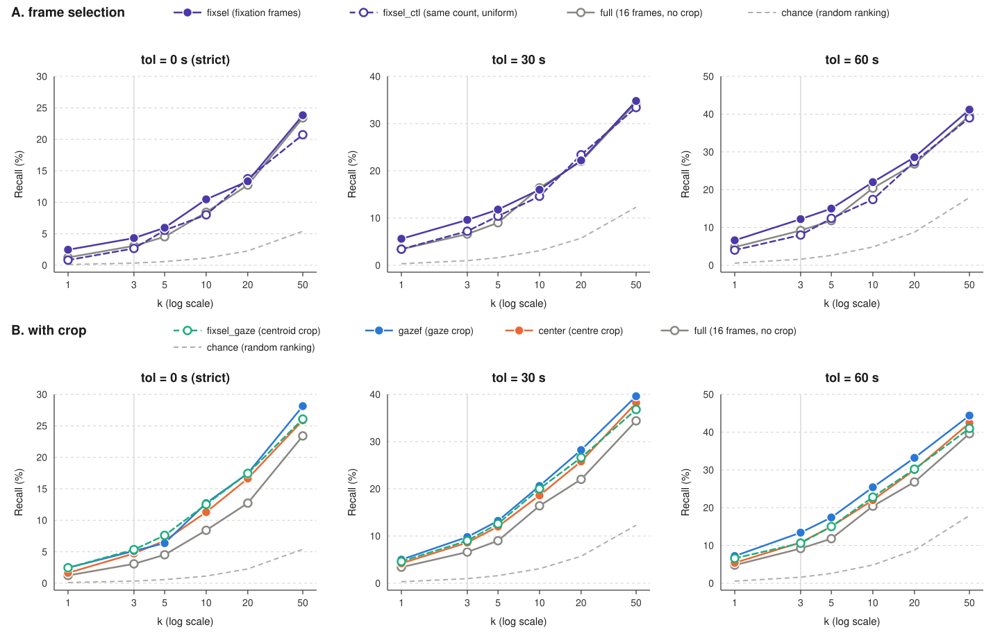
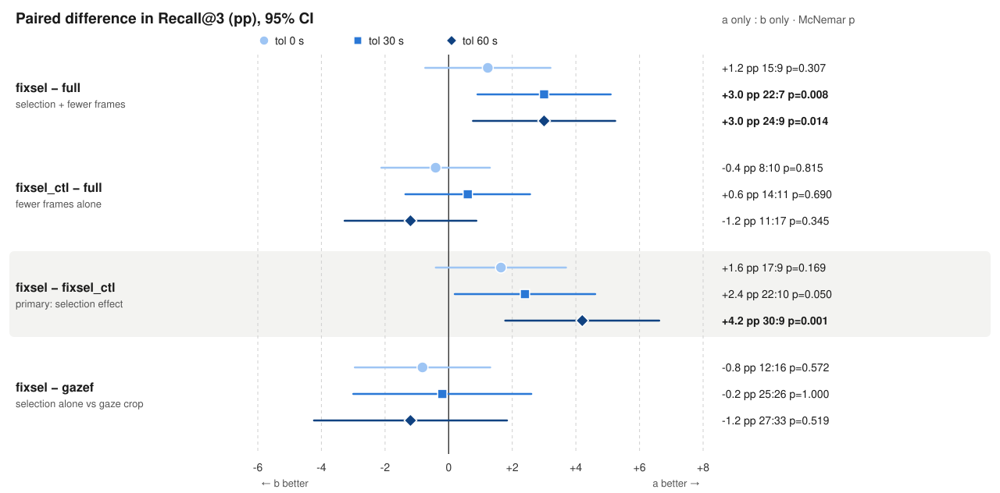

# fixation frame selection

`gaze_crop` 은 프레임마다 **가장 가까운 gaze 샘플 하나**만 쓰고 10 Hz 의 나머지를 버린다
(`gaze_common.gaze_at()`). 그 샘플이 saccade 한가운데면 crop 박스는 아무 의미 없는 지점을 잡는다.

여기서는 10 Hz 전체를 써서 **fixation** — 같은 위치에 머물고(dispersion), 충분히 오래
지속되는(duration) 구간 — 을 검출하고, 그게 crop 대상으로 쓸 만한지 판단한다.

## 파일

| | |
|---|---|
| `fixation_sweep.py` | 검출 임계값 sweep. 클립당 fixation 개수 / duration / **프레임 커버리지** |
| `plot_long_fixations.py` | 긴 fixation 을 눈으로 확인. 진짜 fixation 인가, smooth pursuit 인가 |
| `streamgaze/` | 외부 참고 코드(EGTEA / Ego4D / HoloAssist). `preprocess/gaze_processing.py` 의 `extract_fixation_segments` 를 이 실험이 쓴다 |
| `embed_fix_arms.py` | fixation 프레임만 골라 임베딩. `fixsel` / `fixsel_gaze@R` / `fixsel_gazef@R` / `fixsel_ctl` arm |
| `run_recall.sh` | 위 arm 들을 `full` / `gazef@R` 와 recall 로 비교 |
| `plot_recall_curves.py` | recall 결과 그래프 (`analysis/recall_curves*.svg`, `analysis/paired_k3*.svg`) |
| `results/`, `analysis/recall_*_tol{0,30,60}.*` | recall 채점 원본 (json) / 표 (md) |

`gaze_points.json`, `pool.json`, `gaze_common.py` 는 **`../gaze_crop` 에 그대로 두고 읽기만 한다.**
두 실험이 같은 클립·같은 gaze 를 말하게 하려는 것이고, 새 파일을 만들지 않는다.

## `extract_fixation_segments` 에 가한 수정

streamgaze 원본을 이 데이터에 그대로 쓰면 **fixation 이 절대 끝나지 않는다.** 원본의 버그라기보다
데이터셋 차이다 — streamgaze 는 invalid 샘플을 버려 시간 구멍이 생기는 데이터(EGTEA / Ego4D / HoloAssist)를
전제로 짜였고, EgoLife gaze 는 구멍 없이 10 Hz 로 균일하다.

```python
if dist > radius_thresh:
    gap_duration = timestamps[i] - timestamps[i-1]   # 연속 샘플 간 dt
    if gap_duration <= gap_thresh:                   # 10 Hz 에서 항상 0.1 <= 0.2 -> 항상 참
        i += 1; continue                             # -> 클립 전체가 fixation 1 개
```

30 초 동안 두 지점을 1 초씩 번갈아 보는 합성 신호로 확인: 원본은 `n_fix = 1` (29.9 초),
수정본은 `n_fix = 30`.

수정 내용:

- **`gap_thresh` 의 의미** — 이탈이 시작된 지점부터 시간을 재고, 반경 안으로 돌아오면 리셋.
  이제 진짜로 "반경 밖에 머문 시간" 이다.
- **`dropout_thresh` 신설 (기본 0.4 초)** — 샘플 결손(눈깜빡임·트래킹 실패)은 반경 이탈과
  성격이 다르다. 눈깜빡임은 flick 보다 길어서 임계도 따로 둔다. 결손 구간은 centroid 평균에서 빠진다.
- **거리 기준을 첫 샘플 → running centroid 로** — 첫 샘플 노이즈에 구간 전체가 끌려가지 않는다.
  용서된 이탈 샘플은 centroid 계산에서 제외한다.

## 결과: 임계값

A1_JAKE 6222 클립, `radius=0.05  min_dur=0.3s  dropout=0.4s`:

| gap | fix/clip | dur_med | dur_p90 | coverage | >3s |
|---|---|---|---|---|---|
| 0.1 | 20.37 | 0.70s | 2.20s | 73.7% | 5.4% |
| 0.2 | 18.54 | 0.80s | 2.50s | 74.5% | 6.7% |
| 0.3 | 16.56 | 0.90s | 2.80s | 75.0% | 8.5% |

**무릎(knee)이 없다.** 세 지표가 전부 매끄럽게 단조 변화한다. 그리고 결정적으로 **coverage 가
거의 안 움직인다**(총 1.3 pp). 0.1 이 fixation 을 쪼개고 있었다면 gap 을 늘려 붙일 때 그 사이
프레임들이 새로 들어오면서 coverage 가 올라야 하는데, 안 올랐다. 즉 gap 을 늘려 사라진 fixation 들은
원래 프레임을 커버하지 않던 짧은 조각이고, 늘어난 건 병합이다(`>3s` 가 처음부터 계속 오르는 것과 일치).

**0.1 에서 이미 쪼개짐 구간을 벗어나 있다. gap 은 이 실험에서 중요한 파라미터가 아니다.**
`0.2` 를 쓴다 — 0.3 은 얻는 것 없이 병합만 늘고, 0.1 은 눈깜빡임 전후 튐을 못 넘겨 조각을 만든다.

## 결과: coverage 74%

원래 알고 싶었던 숫자다. `embed_arms.py` 가 crop 하는 **16 개 프레임 중 3/4 가 fixation 안에 있다.**
fixation-aware arm 을 만들면 프레임의 74 % 에서 "nearest sample" 대신 "fixation centroid" 를 쓰고,
26 % 만 폴백한다. **arm 을 만들 가치가 있다.**

정합성도 맞는다: 30 초 클립당 18.5 개 × 평균 ~1.1 초 ≈ 20 초 ≈ 67 %, coverage 74 % 와 일관된다.
1.6 초마다 시선이 옮겨가는 셈인데 요리·대화 중심 활동으로 타당하다. `no-fix clips = 0.0%` 라
폴백만 타는 죽은 클립도 없다. `dur_med 0.8s` 가 `min_dur=0.3s` 바닥에서 충분히 떨어져 있어
검출 결과가 임계값에 눌린 인공물도 아니다.

## 알려진 한계

- **I-DT 는 smooth pursuit 을 fixation 과 구별하지 못한다.** 천천히 움직이는 대상을 따라가도
  연속 샘플은 서로 가깝다. `plot_long_fixations.py` 가 이걸 검사한다 (아래).
- **10 Hz 로는 saccade 를 못 잡는다.** saccade 는 20–80 ms 라 샘플 한 개 안에서 끝난다.
  streamgaze 의 `detect_saccade_segments_ivt_dispersion` (I-VT) 은 이 데이터에서 의미가 희박하다.
  fixation 검출만 10 Hz 로 성립한다(fixation 은 보통 200 ms 이상 = 샘플 2 개 이상).
- **여기서 말하는 fixation 은 "이미지 상에서 안정된 응시" 다.** EgoLife gaze 는 eye-in-head
  yaw/pitch 를 카메라 평면에 투영한 이미지 좌표라, 머리가 돌아가는 동안 세계의 한 점을 계속 보면
  (VOR) 이미지 좌표상 gaze 는 움직인다. crop 박스 안정화가 목적이라면 오히려 이 정의가 맞다.
- **`radius` 는 각도가 아니라 이미지 거리다.** `px`/`py` 가 각각 width/height 로 정규화되어 있어
  프레임이 정사각형이 아니면 `hypot` 이 x/y 를 다른 척도로 섞는다. Aria RGB native 1408×1408
  기준 `radius=0.05` ≈ 70 px ≈ 6–7°.

## 사용법

```bash
cd experiments/fixation_frame_selection

# 임계값 sweep (GPU 불필요)
python fixation_sweep.py                                  # gap 0.1/0.2/0.3
# radius 는 한 번에 하나씩
python fixation_sweep.py --gap 0.2 --radius 0.03

# 긴 fixation 눈으로 확인 -> analysis/long_fixations.jpg
python plot_long_fixations.py                             # 가장 긴 6 개
python plot_long_fixations.py --sort straightness         # pursuit 의심 순
python plot_long_fixations.py --min-dur-shown 5 --rows 10
```

### `plot_long_fixations.py` 가 보여주는 것

sweep 의 `>3s` 가 진짜 fixation 인지 잘못 묶인 pursuit 인지 가른다. 판별 지표는 gaze 경로의 **모양**:

```
straightness = |마지막 - 처음| / (스텝 길이의 합)     # 0.3초 평활한 경로 위에서
```

**반드시 평활한 경로에서 재야 한다.** 원시 샘플로 재면 pursuit 을 전혀 못 잡는다:
분모(path)는 샘플마다의 tracker 노이즈를 전부 더하는데 분자(net)는 검출기의 `radius` 에
막혀 있어서, drift 가 있든 없든 긴 구간은 전부 0 근처로 눌린다. 순수 pursuit 을 검출기에
통과시키면 원시 경로에서 0.00–0.25 가 나온다 — "배회" 구간 안이다.

검출기에 대고 시뮬레이션으로 보정한 임계 (평활 후):

| | jitter 0.002 | 0.008 | 0.015 |
|---|---|---|---|
| **drift 0 (진짜 fixation)** | 0.05 | 0.05 | 0.05 |
| pursuit 0.005/s | 0.59 | 0.15 | 0.07 |
| pursuit 0.010/s | 0.84 | 0.32 | 0.16 |
| pursuit 0.020/s | 0.96 | 0.63 | 0.33 |

```
  <= 0.15   진짜 fixation   (drift 0 대조군이 노이즈와 무관하게 0.05)
  >= 0.30   pursuit
```

노이즈가 큰 상태의 느린 drift(0.005/s)는 여전히 숨는다. 다만 그건 6 초에 화면의 0.03 이라
crop 박스를 움직이지 못하므로 이 실험에서는 문제가 아니다.

그림에서는 노란 점이 현재 gaze, 파란 점이 이 fixation 의 이전 샘플들이다. **pursuit 이면 파란
점이 패널을 가로지르는 선을 그리고, 진짜 fixation 이면 한 덩어리로 뭉친다.** 흰 원은 검출기가
허용한 `radius`, 파란 박스는 fixation-aware arm 이 그 구간 내내 고정할 crop 이다.
그림을 그리기 전에 전체 분포(straightness p10/median/p90, pursuit 비율)를 먼저 출력한다.

## 프레임 선택 arm: `embed_fix_arms.py`

`gaze_crop` 은 16 프레임을 **어디를 crop 할지** 만 바꿨다. 여기서는 **어떤 프레임을 임베딩할지**
를 바꾼다. fixation 밖 프레임은 saccade 한가운데라 모션 블러가 끼고 주체가 보지 않던 장면이므로,
crop 하는 게 아니라 버린다. **fixation 프레임이 하나도 없는 클립은 임베딩하지 않는다** — 그 arm 에서
아예 빠지고, `recall_eval.py` 가 그 클립이 정답인 문항을 `unscorable` 로 빼준다(다른 걸 슬쩍
끼워넣지 않는다).

| arm | 프레임 | crop |
|---|---|---|
| `full` | 균일 16 | 없음 (baseline) |
| `gazef@R` | 균일 16 | 프레임별 gaze |
| `fixsel` | fixation 안에 든 것만 (~12/16) | 없음 |
| `fixsel_ctl` | `fixsel` 과 **같은 개수**, 클립 전체에 균일 | 없음 |
| `fixsel_gaze@R` | fixation 안에 든 것만 | 그 fixation 의 **centroid** (fixation 마다 박스 하나 고정) |
| `fixsel_gazef@R` | fixation 안에 든 것만 | 프레임별 gaze (**`gazef@R` 과 같은 crop**) |

이름은 gaze_crop 규칙을 따른다: 끝의 `f` 는 **박스가 프레임마다 gaze 를 따라간다**는 뜻이다
(gaze_crop 의 `gaze@R` 은 클립당 박스 하나, `gazef@R` 은 프레임마다). **2026-09-29 이전에는 centroid arm 을
`fixsel_gazef` 라고 불렀다.** 결과 파일(`results/`, `analysis/recall_*`)의 키는 `fixsel_gaze_05` 로 바꿨고,
서버의 옛 `emb/fixsel_gazef_05.npz` 는 `run_recall.sh` 가 발견하면 옮기라는 `mv` 명령을 찍고 멈춘다.
옮기지 않고 새 `fixsel_gazef` 를 만들더라도, `embed_fix_arms.py` 가 meta 의 `crop_centre` 를 보고 centroid 로
만든 행을 이어받지 않고 다시 만든다.

`fixsel_ctl` 은 빼면 안 된다. 프레임을 26 % 버리는 것 자체가 인코더 입력의 변화이고(개수가
줄고 시간적으로 촘촘해진다) VLM2Vec 은 프레임을 pooling 한다. 이게 없으면 "fixsel 이 full 을
이겼다" 를 "16 프레임보다 12 프레임이 나았다" 와 분리할 수 없다. **`gazef@R` 에 `center@R` 이
했던 역할이다.** 읽는 법:

```
fixsel - fixsel_ctl   프레임 선택의 효과          <- 이게 이 실험의 결과다
fixsel - full         선택 효과 + "프레임이 줄었다" 가 섞인 값
```

`fixsel_gaze` 의 crop 중심은 프레임의 최근접 gaze 샘플이 아니라 **fixation centroid** 다. fixation 안에서
샘플은 `radius` 만큼 흩어지므로 그 평균이 "보고 있던 한 점" 의 더 좋은 추정이고, 구간 내내 박스를
고정시킨다. 다만 `radius=0.05` 에 박스 한 변이 0.5 라서 두 중심의 차이는 박스 한 변의 1/10 이하다 —
`fixsel_gaze` 와 `fixsel_gazef` 는 거의 같은 픽셀을 본다. `fixsel_gazef` 는 `gazef` 와의 비교에서 **바뀌는 게
프레임 선택 하나뿐이도록** 따로 둔 arm 이다.

`--select` 는 두 가지다. `subset`(기본)은 baseline 이 쓰는 **같은** 16 개 시각 중 fixation 밖을
버리므로 `full` 과 삭제 하나만큼 다르다(개수가 클립마다 변한다). `refill` 은 fixation 시간의
합집합 위에서 16 개를 균일하게 다시 뽑아 개수를 16 으로 고정한다 — 개수 교란이 없어지지만
baseline 이 본 적 없는 시각을 보게 된다. **두 모드를 한 표에 섞지 말 것.**

```bash
# GPU 불필요: 프레임 개수 / 버려진 클립만 센다 (기본 pool.json, 623 클립)
python embed_fix_arms.py --dry-run

# 임베딩 + recall 비교. 기본이 stage 2 의 전체 풀(6,223 클립 / 500 문항)이라 ~6시간이다
nohup bash run_recall.sh > /dev/null 2>&1 &
tail -f logs/recall_*.log

POOL=../gaze_crop/pool.json bash run_recall.sh   # stage 1 의 623 클립 (~35분, 120 문항)
SELECT=refill bash run_recall.sh                 # 개수 고정 모드
RADIUS=0.03 bash run_recall.sh
SKIP_EMBED=1 bash run_recall.sh                  # emb/ 에 있는 걸로 채점만 다시
```

끊겨도 안전하다 — 50 클립마다 체크포인트하고 다시 실행하면 이어받는다. 안전하지 않은 건
중간에 `--radius`/`--select` 를 바꾸는 것이고, 그건 arm 을 버리고 처음부터 다시 만든다(의도된
동작이다).

실측 속도 (`gaze_crop/logs/`, gpu2): 클립당 ≈ 디코드 1.05s + arm 당 0.76s.

| | 623 클립 | 6,223 클립 |
|---|---|---|
| fixation arm 3개 | ~35분 | **~5.8시간** |
| `full` + `gazef@0.5` (먼저 필요) | ~27분 | ~2.7시간 |

`run_recall.sh` 는 `full`/`gazef@R` 를 **절대 다시 만들지 않는다.** 재실행이 기준선을 조용히
바꾸면 안 되기 때문이다. 대신 preflight 에서 **행 개수**까지 본다 — npz 경로에는 풀 크기가
안 적혀 있어서, stage 1 의 623클립 `full.npz` 가 6,223클립짜리가 있어야 할 자리에 그대로 앉는다.
`recall_eval.py` 는 모든 arm 이 채점 가능한 문항만 쓰므로, 그러면 표가 stage 1 클립으로
쪼그라든 채 맨 위에는 500 문항이라고 찍힌다. 그래서 풀의 90 % 미만이면 중단한다.

임베딩은 `../gaze_crop/emb/` 에 떨어진다. 같은 디렉터리에 두어야 `recall_eval.py` 가 모든 arm 을
**같은 문항·같은 후보 집합**으로 한 표에서 짝지어 비교한다. `gaze_common.py` 는 건드리지 않았다 —
`load_arms` 가 npz 파일명을 arm 이름으로 읽기 때문에 새 arm 을 등록할 곳이 없다.

저장된 행이 다른 `transform` 이나 다른 검출 임계값으로 만들어졌으면 이어받지 않고 그 arm 을
처음부터 다시 만든다. `radius=0.03` 실행이 `radius=0.05` 행 위에 얹히면 npz 안에서 영영 안 보인다.

## 결과: recall (`subset`, `radius=0.05`, 6,223 클립 / 500 문항)

주 결과는 **tol 0s, k=3 의 `fixsel − fixsel_ctl`** 로 실행 전에 정해 두었다. tol 30s / 60s 는 같은 임베딩을
다시 채점한 **강건성 확인**이다. tol 이 넓어지면 정답 칸이 늘어 recall 이 저절로 오르므로, tol 이 다른 표끼리
recall 숫자를 직접 비교하지 않는다(각 표의 chance 와 비교).

<picture>
  <source media="(prefers-color-scheme: dark)" srcset="analysis/recall_curves_dark.svg">
  
</picture>

위 행(A)은 프레임 선택만, 아래 행(B)은 crop 계열이다. 세로선은 k=3, 회색 점선은 무작위 순위(chance).
`fixsel_ctl` 은 `fixsel` 과 같은 색의 점선 — 둘의 간격이 곧 선택 효과다. `fixsel_gaze`(centroid)는 초록 점선이고,
`fixsel_gazef` 를 채점하면 같은 초록의 실선으로 자동으로 추가된다.

| arm | R@3 tol0 | 순위 중앙값 tol0 | R@3 tol30 | 순위 중앙값 tol30 | R@3 tol60 | 순위 중앙값 tol60 |
|---|---|---|---|---|---|---|
| `full` | 3.1% | 289 | 6.6% | 166 | 9.2% | 99 |
| `fixsel_ctl` | 2.7% | 268 | 7.2% | 137 | 8.0% | 105 |
| **`fixsel`** | 4.3% | 292 | 9.6% | 145 | 12.2% | 91 |
| `center_05` | 4.7% | **245** | 8.6% | **108** | 10.8% | 81 |
| `gazef_05` | 5.1% | 249 | **9.8%** | 113 | **13.4%** | **76** |
| `fixsel_gaze_05` | **5.3%** | 261 | 9.0% | 122 | 10.6% | 80 |
| _chance_ | _0.34%_ | _1,273_ | _0.97%_ | _642_ | _1.6%_ | _428_ |

k=3 짝지은 비교 (95% CI 는 짝지은 비율 차의 Wald 근사, 오른쪽 숫자는 앞 arm만 맞힘 : 뒤 arm만 맞힘):

<picture>
  <source media="(prefers-color-scheme: dark)" srcset="analysis/paired_k3_dark.svg">
  
</picture>

그림의 비교는 `fixsel − full`, `fixsel_ctl − full`, `fixsel − fixsel_ctl`(주 비교, 회색 띠), `fixsel − gazef`,
`fixsel_gazef − gazef` 다. 마지막 것은 `fixsel_gazef` 를 아직 채점하지 않아 비어 있고, 채점하면 그림에 나타난다.

k 별·순위 기준 검정 (k=3 경계만 보면 놓치는 것):

| 비교 | tol | k=1 | k=3 | k=10 | k=50 | 순위 올림:내림 (p) |
|---|---|---|---|---|---|---|
| `fixsel − fixsel_ctl` | 0 | 11:3 | 17:9 | 27:15 | 30:15 | 246:236 (0.68) |
| | 30 | 18:7 | 22:10 | 33:26 | 30:23 | 246:238 (0.75) |
| | 60 | 20:7 | **30:9** | **45:22** | 32:21 | 257:216 (0.066) |
| `fixsel − gazef` | 0 | 9:9 | 12:16 | 19:30 | **23:44** | **217:263 (0.040)** |
| | 30 | 19:16 | 25:26 | **22:45** | **26:50** | **217:265 (0.032)** |
| | 60 | 19:22 | 27:33 | 28:45 | 35:51 | **214:263 (0.028)** |
| `fixsel_gaze − gazef` | 0 | 10:10 | 14:13 | 23:24 | 19:29 | 225:252 (0.23) |
| | 30 | 13:15 | 19:23 | 29:32 | 22:36 | 228:253 (0.27) |
| | 60 | 14:17 | 18:32 | 24:37 | 24:41 | 229:240 (0.64) |

굵은 글씨는 McNemar / 부호검정 p < 0.05. tol 0 의 `center_05` 는 이 실행에서 채점하지 않아
`../gaze_crop/results/recall_arms_tol0.json` 에서 가져왔다 — 같은 풀·임베딩·487 문항이고, `full`/`gazef` 순위가
문항 단위로 완전히 같은지 스크립트가 확인한 뒤에만 합친다. tol 0 이 487 문항인 것은 정답 클립이 풀에 없는
13 문항이 빠져서이고, tol 30/60 에서는 이웃 칸이 정답이 되어 500 문항 모두 채점된다.

### 읽는 법

- **선택 효과(주 비교)는 세 tol 모두 같은 방향이고, tol 이 넓을수록 커진다.** +1.6 → +2.4 → +4.2 pp.
  미리 정한 주 결과(tol 0)는 **p=0.17 로 유의하지 않다.** tol 60 의 p=0.001(30:9) 은 tol 3 개에 대한
  Bonferroni(0.017) 도 통과하지만, tol 을 바꿔 본 결과이므로 확증이 아니라 **"정확한 칸은 못 맞혀도 근처로는
  더 자주 간다"** 는 신호로 읽는다.
- **효과는 순위 상단에 몰려 있다.** k ≤ 10 에서는 `fixsel` 쪽으로 기울지만 500 문항 전체의 순위는 거의
  반반이다(tol 60 에서도 257:216, p=0.066). 모든 문항을 조금씩 올리는 게 아니라 **일부 문항을 top 으로
  끌어올린다.**
- **개수 교란은 없다.** `fixsel_ctl − full` 은 세 tol 모두 유의하지 않다(−0.4 / +0.6 / −1.2 pp). 그래서
  `fixsel − full`(+1.2 / **+3.0** / **+3.0** pp, tol 30·60 에서 p<0.05)은 대부분 선택 효과로 읽을 수 있다.

### gaze crop 대비: fixation 은 효과가 있었나

**없다. 어느 fixation arm 도 `gazef` 를 이기지 못했다.**

- **`fixsel` vs `gazef` — top-3 에서는 동률, 전체 순위에서는 `gazef` 가 낫다.** k=3 에서 −0.8 / −0.2 / −1.2 pp
  (모두 p>0.5)로 구분이 안 되지만, k ≥ 10 부터 `gazef` 쪽으로 벌어지고 순위 부호검정은 **세 tol 모두
  `gazef` 우세(p=0.028–0.040)**. crop 없이 프레임만 골라도 top-3 성능은 gaze crop 만큼 나오지만, 정답 순위를
  전반적으로 끌어올리는 건 crop 이다. 두 방법이 순위의 서로 다른 부분에서 일한다.
- **`fixsel_gaze` vs `gazef` — 선택을 얹은 crop 이 기존 gaze crop 보다 낫지 않다.** +0.2 / −0.8 / −2.8 pp,
  tol 60 에서는 오히려 `gazef` 쪽으로 기운다(18:32, p=0.065). 순위 기준으로도 차이 없음. 위 곡선의 B 행에서
  초록 점선(`fixsel_gaze`)이 파랑(`gazef`) 위로 올라가는 구간은 tol 0 의 k≤5 뿐이다.
- 이 비교에서는 crop 중심도 다르지만(centroid vs 프레임별 gaze) 그 차이는 무시할 만하다. fixation 안의 샘플은
  centroid 에서 `radius=0.05` 안에 있고 박스 한 변은 0.5 라서, 두 박스는 최악의 경우에도 면적의 약 81 %
  (0.45/0.5 = 90 % 씩 가로·세로)가 겹친다. **사실상 바뀐 건 프레임 선택 하나**다. 그렇다면 선택만 하면 top-3
  이 오르는데 crop 과 합치면 이득이 사라지는 이유로 가장 그럴듯한 것은 **중복**이다 — 선택이 시선 밖 내용이
  섞인 프레임을 빼서 얻는 것을 crop 이 이미 얻고 있다. 가설이고, `fixsel_gazef`(프레임별 gaze crop, 즉 `gazef`
  와 crop 이 완전히 같은 arm)로 확인한다.
- `fixsel_gaze` 는 `center` 와도 구분되지 않는다(k=3 15:12 / 19:17 / 18:19, 순위 p>0.4). `gazef − center` 도
  여전히 유의하지 않으므로(+0.4 / +1.2 / +2.6 pp), **gaze 정보가 crop 위치로서 center 보다 낫다는 증거는
  이번에도 없다.**

그래프는 [`plot_recall_curves.py`](plot_recall_curves.py) 로 다시 그린다 (표준 라이브러리만 사용):

```bash
python experiments/fixation_frame_selection/plot_recall_curves.py
# -> analysis/recall_curves{,_dark}.svg, analysis/paired_k3{,_dark}.svg
```

## 다음

- **`SELECT=refill`** — 개수를 16 으로 고정해 개수 교란을 설계에서 없앤다. 선택 효과가 top-k 에서 유지되는지 본다.
- **`fixsel_gazef` 채점** — `gazef` 와 crop 이 같고 프레임 선택만 다르다. 위 기하로 보면 `fixsel_gaze` 와 거의
  같게 나올 것으로 예상한다(다르면 centroid 가 원인이었다는 뜻). 다른 arm 은 `emb/` 에서 이어받으므로 새로
  임베딩하는 건 이 arm 하나다(~3 시간). 옛 `fixsel_gazef_05.npz` 가 서버에 있으면 `run_recall.sh` 가 먼저
  `mv` 를 안내하고 멈춘다:
  ```bash
  CUDA_VISIBLE_DEVICES=3 nohup bash run_recall.sh > /dev/null 2>&1 &   # tol 0/30/60 모두 채점
  python plot_recall_curves.py                                         # 그림에 자동으로 추가된다
  ```
- `gap=0.2` 고정. `radius` 를 0.03 / 0.05 / 0.08 로 훑어 coverage 와 `>3s` 의 trade-off 를 본다
  (이쪽이 지배적인 파라미터다). 다만 위 결과로 보면 recall 을 바꿀 가능성은 위 두 개보다 낮다.
